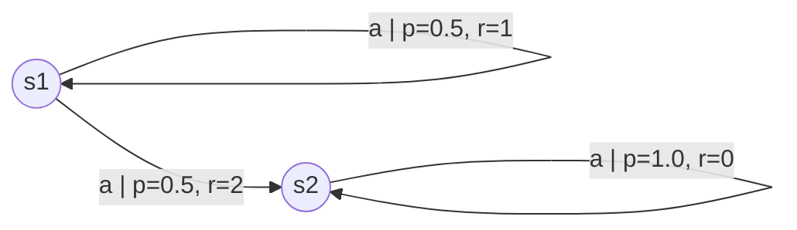
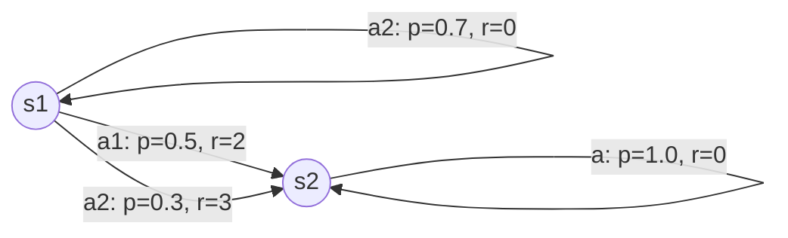

# Markov Decision Processes (MDPs)

## 1. MDP 基本概念

Markov Decision Process（MDP）是一种用于描述决策问题的数学模型，特别适合于强化学习和序列决策问题。

MDP 由以下五个要素组成：

- 状态集合 $S$ ：系统可能处于的所有状态。
- 动作集合 $A$ ：在每个状态可以采取的动作。
- 状态转移概率 $P(s'\mid s, a)$：在状态 $s$ 下采取动作 $a$，转移到下一个状态 $s'$ 的概率。
- 即时奖励函数 $R(s,a,s')$：从 $s$ 经过 $a$ 转移到 $s'$ 时获得的奖励。
- 折扣因子 $\gamma \in [0,1]$：用于衡量未来奖励的现值。

MDP 的核心假设是“马尔可夫性”，即当前状态已经包含了决策所需的全部信息，未来转移仅依赖当前状态和动作，而与过去历史无关。

## 2. 策略与价值函数

策略 $\pi(a\mid s)$ 描述了智能体在状态 $s$ 下选择动作 $a$ 的概率。常见的策略有：

- 确定性策略 $\pi(s)$：每个状态选择一个固定动作。
- 随机策略 $\pi(a\mid s)$：在状态下按概率选择动作。

在强化学习中，我们关注的不是单步奖励本身，而是从当前时刻起，未来所有奖励的累积期望值，即“期望回报”（Expected Return）。例如，如果一个动作有 20% 的概率获得 500，80% 的概率获得 250，则这一步的期望回报为

$$
0.2\times 500 + 0.8\times 250 = 300.
$$

期望回报是 value function 的核心思想：它描述了在给定策略下，从当前状态开始能够预期获得多少总回报。

### 状态价值函数

状态价值函数 $V^{\pi}(s)$：在策略 $\pi$ 下，从状态 $s$ 开始，预期累积回报。

$$
V^{\pi}(s)=\mathbb{E}_{\pi}\left[\sum_{t=0}^{\infty} \gamma^{t} r_{t+1} \mid s_{0}=s\right]
$$

### 动作价值函数

动作价值函数 $Q^{\pi}(s,a)$：从状态 $s$ 采取动作 $a$，之后按策略 $\pi$ 行动的预期累积回报。

$$
Q^{\pi}(s,a)=\mathbb{E}_{\pi}\left[\sum_{t=0}^{\infty} \gamma^{t} r_{t+1} \mid s_{0}=s, a_{0}=a\right]
$$

## 3. Bellman 方程

Bellman 方程给出了价值函数的递归表达：一个状态或动作的价值等于当前奖励与未来价值的加权期望。

对于状态价值函数：

$$
V^{\pi}(s)=\sum_{a} \pi(a\mid s) \sum_{s'} P(s'\mid s,a) \left[R(s,a,s') + \gamma V^{\pi}(s')\right]
$$

对于动作价值函数：

$$
Q^{\pi}(s,a)=\sum_{s'} P(s'\mid s,a) \left[R(s,a,s') + \gamma \sum_{a'} \pi(a'\mid s') Q^{\pi}(s',a')\right]
$$

### 3.1 具体例子：简单 MDP 计算

假设一个简单 MDP，只有两个状态 $S=\{s_{1}, s_{2}\}$，每个状态只有一个动作 $a$。

状态转移和奖励如下：

- 从 $s_{1}$ 采取动作 $a$，有 50% 转移到 $s_{1}$ 并获得奖励 1，50% 转移到 $s_{2}$ 并获得奖励 2。
- 从 $s_{2}$ 采取动作 $a$，100% 转移回 $s_{2}$ 并获得奖励 0。
- 折扣因子 $\gamma=0.9$。

在这个例子中，由于每个状态只有一个动作，策略 $\pi$ 可以忽略，价值函数直接由状态转移和奖励决定。

状态价值函数的 Bellman 方程变为：

$$
V(s_{1}) = 0.5 \left[1 + 0.9 V(s_{1})\right] + 0.5 \left[2 + 0.9 V(s_{2})\right]
$$

$$
V(s_{2}) = 1.0 \left[0 + 0.9 V(s_{2})\right]
$$

第二个公式可以直接解得：

$$
V(s_{2}) = 0.9 V(s_{2}) \Rightarrow V(s_{2}) = 0
$$

第一个公式代入后得到：

$$
V(s_{1}) = 0.5 \left[1 + 0.9 V(s_{1})\right] + 0.5 \left[2 + 0.9 \cdot 0\right]
$$

$$
V(s_{1}) = 0.5 + 0.45 V(s_{1}) + 1
$$

$$
V(s_{1}) = 1.5 + 0.45 V(s_{1}) \Rightarrow 0.55 V(s_{1}) = 1.5 \Rightarrow V(s_{1}) = \frac{1.5}{0.55} \approx 2.73
$$

这个例子说明了 Bellman 方程如何把当前奖励和未来状态价值结合起来求解：

- $1$ 和 $2$ 分别是当前的即时奖励。
- $0.9 V(s_{1})$ 和 $0.9 V(s_{2})$ 是未来价值的折扣部分。
- 通过对不同转移结果求期望，得到当前状态的整体价值。

如果有多个动作，动作价值函数 $Q^{\pi}(s,a)$ 也会类似地对每个后续状态和后续动作的价值求期望。

### 3.2 动作价值函数的具体计算

继续用一个扩展的例子说明动作价值函数的计算。假设状态 $s_{1}$ 有两个备选动作 $a_{1}$ 和 $a_{2}$，状态 $s_{2}$ 只有一个动作 $a$。

转移和奖励设定为：

- 在 $s_{1}$ 采取 $a_{1}$：50% 转移到 $s_{1}$，奖励 1；50% 转移到 $s_{2}$，奖励 2。
- 在 $s_{1}$ 采取 $a_{2}$：70% 转移到 $s_{1}$，奖励 0；30% 转移到 $s_{2}$，奖励 3。
- 在 $s_{2}$ 采取 $a$：100% 留在 $s_{2}$，奖励 0。
- 折扣因子仍然为 $\gamma=0.9$。

假设策略在 $s_{2}$ 上只有一个动作，因此我们只需知道 $V^{\pi}(s_{2})$。如果已知 $V^{\pi}(s_{2})=0$，那么：

$$
Q^{\pi}(s_{1},a_{1}) = 0.5\left[1 + 0.9 V^{\pi}(s_{1})\right] + 0.5\left[2 + 0.9 V^{\pi}(s_{2})\right]
$$

$$
Q^{\pi}(s_{1},a_{2}) = 0.7\left[0 + 0.9 V^{\pi}(s_{1})\right] + 0.3\left[3 + 0.9 V^{\pi}(s_{2})\right]
$$

这里的含义是：

- 当前选择的动作 $a_{1}$ 或 $a_{2}$ 决定了即时奖励和后续状态分布。
- 对每个可能的后续状态 $s'$，我们计算当前奖励加上折扣后的 $V^{\pi}(s')$。
- 最后对所有 $s'$ 求和，得到该动作在当前状态下的总期望价值。

如果进一步假设策略在 $s_{1}$ 上固定选择 $a_{1}$，那么 $V^{\pi}(s_{1}) = Q^{\pi}(s_{1},a_{1})$，这时可以把式子变成一个关于 $Q^{\pi}(s_{1},a_{1})$ 的方程并求解。

这个例子帮助你理解：

- $V^{\pi}(s)$ 是按策略选择动作后的整体价值。
- $Q^{\pi}(s,a)$ 是在当前状态下，先固定动作 $a$ 再考虑未来的价值。

## 4. 最优策略与最优价值函数

最优策略 $\pi^{*}$ 是使得累积奖励最大化的策略。对应的最优价值函数为：

$$
V^{*}(s)=\max_{\pi} V^{\pi}(s)
$$

$$
Q^{*}(s,a)=\max_{\pi} Q^{\pi}(s,a)
$$

最优 Bellman 方程为：

$$
V^{*}(s)=\max_{a} \sum_{s'} P(s'\mid s,a) \left[R(s,a,s') + \gamma V^{*}(s')\right]
$$

$$
Q^{*}(s,a)=\sum_{s'} P(s'\mid s,a) \left[R(s,a,s') + \gamma \max_{a'} Q^{*}(s',a')\right]
$$

## 5. 常见求解方法

- 策略迭代（Policy Iteration）：交替进行策略评估和策略改进。
- 价值迭代（Value Iteration）：直接对价值函数进行迭代更新，直到收敛。
- Q-learning：一种基于采样的强化学习算法，无需知道转移概率。
- SARSA：基于 on-policy 更新过程的动作价值方法。

## 6. 例子：简单网格世界

假设一个简单网格世界，状态是智能体的位置，动作为上下左右移动。每一步获得的奖励可能是 -1，终点状态获得 +10。折扣因子 $\gamma=0.9$。通过求解 MDP，可以得到每个状态下的最优动作，从而形成最短路径或最优策略。

## 7. 备注

- MDP 是强化学习理论的基础，很多 RL 算法都可以看成是求解或近似求解 MDP。
- 若状态转移或奖励不完全可观测，则需要扩展到 POMDP（部分可观测 Markov 决策过程）。
- 在实践中，状态空间较大时通常使用函数近似或深度方法来估计价值函数。

## REFERENCE
https://gibberblot.github.io/rl-notes/index.html
