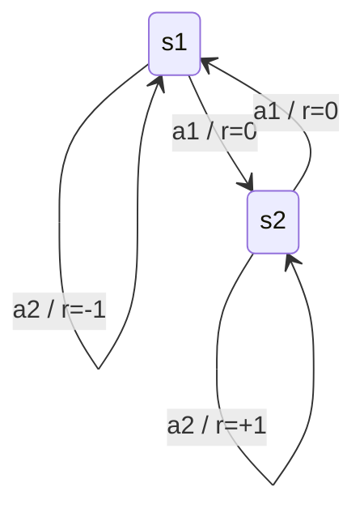

# Q-Learning 与 SARSA

## 1. 算法简介

Q-Learning 和 SARSA 都是基于动作价值函数 $Q(s,a)$ 的强化学习方法，用于在未知环境中通过交互学习最优策略。

- Q-Learning 是 off-policy：使用目标动作 $\max_{a'} Q(s',a')$ 来更新当前 Q 值。
- SARSA 是 on-policy：使用实际执行的后继动作 $a'$ 来更新当前 Q 值。

## 2. 更新公式

### 2.1 Q-Learning

$$
Q(s,a) \leftarrow Q(s,a) + \alpha \left[ r + \gamma \max_{a'} Q(s',a') - Q(s,a) \right]
$$

- $s$：当前状态。
- $a$：当前动作。
- $r$：当前奖励。
- $s'$：下一个状态。
- $\alpha$：学习率。
- $\gamma$：折扣因子。
- $\max_{a'} Q(s',a')$：下一个状态的最大 Q 值。

### 2.2 SARSA

$$
Q(s,a) \leftarrow Q(s,a) + \alpha \left[ r + \gamma Q(s',a') - Q(s,a) \right]
$$

其中 $a'$ 是在 $s'$ 下按当前策略实际选择的动作。

## 3. Q-Learning 与 SARSA 的本质区别

- Q-Learning 用的是“假设后续总能选择最优动作”的估计，因此更偏向最优策略。
- SARSA 用的是“当前策略实际会选择的动作”，因此更符合当前策略的行为。

这意味着：

- 在探索时，Q-Learning 可能会学习一条风险更大的最优路径。
- SARSA 会把探索进程中的实际行为纳入更新，因此更保守。

## 4. 例子：带 Q-table 的计算

假设一个简单环境：

- 状态 $S = \{s_{1}, s_{2}\}$。
- 动作 $A = \{a_{1}, a_{2}\}$。
- 初始 Q-table 全部为 0。

| 状态 | $a_{1}$ | $a_{2}$ |
|:----:|:-------:|:-------:|
| $s_{1}$ | 0 | 0 |
| $s_{2}$ | 0 | 0 |

状态转移和奖励：

- $s_{1}$:
  - $a_{1}$ -> $s_{2}$，奖励 $0$。
  - $a_{2}$ -> $s_{1}$，奖励 $-1$。
- $s_{2}$:
  - $a_{1}$ -> $s_{1}$，奖励 $0$。
  - $a_{2}$ -> $s_{2}$，奖励 $+1$。

设置 $\alpha = 0.5$，$\gamma = 0.9$。

### 4.1 Q-Learning 计算过程

#### 4.1.1 第一步

经历：从 $s_{1}$ 选择 $a_{1}$，到达 $s_{2}$，奖励 $0$。

更新公式：

$$
Q(s_{1},a_{1}) \leftarrow 0 + 0.5 \left[0 + 0.9 \max(Q(s_{2},a_{1}), Q(s_{2},a_{2})) - 0\right]
$$

因为当前 $Q(s_{2},a_{1}) = Q(s_{2},a_{2}) = 0$，所以：

$$
Q(s_{1},a_{1}) = 0
$$

Q-table：

| 状态 | $a_{1}$ | $a_{2}$ |
|:----:|:-------:|:-------:|
| $s_{1}$ | 0 | 0 |
| $s_{2}$ | 0 | 0 |

#### 4.1.2 第二步

经历：从 $s_{2}$ 选择 $a_{2}$，到达 $s_{2}$，奖励 $+1$。

更新：

$$
Q(s_{2},a_{2}) \leftarrow 0 + 0.5 \left[1 + 0.9 \max(Q(s_{2},a_{1}), Q(s_{2},a_{2})) - 0\right] = 0.5
$$

Q-table：

| 状态 | $a_{1}$ | $a_{2}$ |
|:----:|:-------:|:-------:|
| $s_{1}$ | 0 | 0 |
| $s_{2}$ | 0 | 0.5 |

#### 4.1.3 第三步

再次经历：从 $s_{1}$ 选择 $a_{1}$，到达 $s_{2}$，奖励 $0$。

更新：

$$
Q(s_{1},a_{1}) \leftarrow 0 + 0.5 \left[0 + 0.9 \times 0.5 - 0\right] = 0.225
$$

Q-table：

| 状态 | $a_{1}$ | $a_{2}$ |
|:----:|:-------:|:-------:|
| $s_{1}$ | 0.225 | 0 |
| $s_{2}$ | 0 | 0.5 |

### 4.2 SARSA 计算过程

假设当前策略在 $s_{2}$ 也选择 $a_{2}$，并且经过相似的体验。

#### 4.2.1 第一步

经历：$s_{1}, a_{1}, s_{2}, r=0$；后继动作 $a'=a_{2}$。

更新：

$$
Q(s_{1},a_{1}) \leftarrow 0 + 0.5 \left[0 + 0.9 Q(s_{2},a_{2}) - 0\right] = 0
$$

#### 4.2.2 第二步

经历：$s_{2}, a_{2}, s_{2}, r=1$；后继动作 $a'=a_{2}$。

更新：

$$
Q(s_{2},a_{2}) \leftarrow 0 + 0.5 \left[1 + 0.9 Q(s_{2},a_{2}) - 0\right] = 0.5
$$

Q-table：

| 状态 | $a_{1}$ | $a_{2}$ |
|:----:|:-------:|:-------:|
| $s_{1}$ | 0 | 0 |
| $s_{2}$ | 0 | 0.5 |

#### 4.2.3 第三步

再次经历：$s_{1}, a_{1}, s_{2}, r=0$；后继动作 $a'=a_{2}$。

更新：

$$
Q(s_{1},a_{1}) \leftarrow 0 + 0.5 \left[0 + 0.9 \times 0.5 - 0\right] = 0.225
$$

Q-table：

| 状态 | $a_{1}$ | $a_{2}$ |
|:----:|:-------:|:-------:|
| $s_{1}$ | 0.225 | 0 |
| $s_{2}$ | 0 | 0.5 |

在这个例子中，Q-learning 和 SARSA 的值更新结果相同，因为后继动作恰好是当前最大的动作。但它们的更新目标不同：

- Q-learning 用 $\max_{a'} Q(s',a')$。
- SARSA 用实际执行的 $Q(s',a')$。

## 5. 何时用 Q-learning / SARSA

- 如果想学习最优策略，并且可以允许假设后续动作最优，优先考虑 Q-learning。
- 如果想让学习更符合实际策略行为，或者在有探索风险时希望更稳健，优先考虑 SARSA。

## 6. 参考

- Q-learning：off-policy TD 控制方法。
- SARSA：on-policy TD 控制方法。
- Q-table 可以直接可视化为每个状态-动作对的价值，便于理解学习过程。